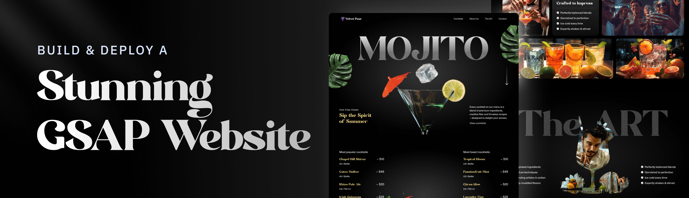

 

 

<h3 align="center">Stunning GSAP Cocktail Website</h3>

A modern, scroll-driven web experience showcasing delightful cocktails with advanced animations.

📋 Table of Contents

✨ Overview

⚙️ Tech Stack

🚀 Key Features

🤸 Getting Started

🔮 Future Roadmap

🙏 Acknowledgements

<a name="overview">✨ Overview</a>

Welcome to the Animated Cocktails project! This is a visually rich, scroll-driven website I've built to explore and demonstrate advanced web animations using React and GSAP (GreenSock Animation Platform). It's designed to provide a smooth and engaging user experience, bringing a cocktail showcase to life with dynamic interactions and responsive design.

This project focuses on leveraging modern frontend technologies to create a high-performance, animated interface

<a name="tech-stack">⚙️ Tech Stack</a>

--> GSAP: The GreenSock Animation Platform is a robust JavaScript library I used to craft dynamic, scroll-driven visuals. It enables features like SplitText animations for engaging text reveals, ScrollTrigger for precise timeline control, smooth parallax scrolling, pinned sections, and custom animated carousels.

--> React: I've utilized React to build a declarative and component-based user interface. This approach allows for modular development, seamless integration of complex GSAP animations, efficient state management, and ensures a responsive layout adaptable to various screen sizes.

--> Tailwind CSS: For styling, I chose Tailwind CSS, a utility-first framework. It allowed me to rapidly design and implement custom user interfaces by applying low-level utility classes directly within the components, streamlining the styling workflow.

--> Vite: The development workflow for this project is powered by Vite, a next-generation frontend tool. It provides a lightning-fast build process, instant hot module replacement, and optimized production builds, which is ideal for an animation-heavy React application requiring real-time development feedback.

<a name="key-features">🚀 Key Features</a>

1. SplitText Animations: Dynamic and impactful text reveals using GSAP's SplitText for engaging introductions and section highlights.

2. ScrollTrigger Effects: Advanced scroll-based animations and precise timeline control powered by GSAP's ScrollTrigger.

3. Parallax Scrolling: Immersive depth added through smooth parallax effects that respond fluidly to user scroll actions.

4. Pinned Sections: Sections can be "pinned" in view while animating their internal content, creating compelling scroll experiences.

5. Scroll-Synced Video Playback: Video progress is synchronized with scroll position for cinematic and interactive storytelling.

6. Image Masking Effects: Visually striking image transitions achieved with scroll-triggered pins and masking techniques.

7. Custom Carousel: A fully customized, animated carousel with multiple navigation options and smooth slide transitions.

8. Seamless Timeline Animations: Artfully crafted animation timelines that flow smoothly across different sections of the website.

9. Responsive Design: A fluid and adaptive UI, ensuring all GSAP animations and layouts perform beautifully across all screen sizes.

<a name="getting-started">🤸 Getting Started</a>

Follow these steps to set up and run this project locally on your machine.

Prerequisites

Ensure you have the following installed:

1. Git

2. Node.js

3. npm (Node Package Manager)

Installation & Running

Clone this repository:
> git clone https://github.com/Kash4Code/animated_cocktails.git

> cd animated_cocktails

(Remember to replace Kash4Code with your actual GitHub username.)

Install dependencies:

> npm install

Start the development server:

> npm run dev

Open http://localhost:5173 in your browser to view the project.

<a name="future-roadmap">🔮 Future Roadmap</a>

1. I have several features planned to scale this project and enhance its functionality. The goal is to evolve this from a showcase into a fully interactive web application.

2. API Integration: Transition from static data to a dynamic backend by integrating a public API like TheCocktailDB to fetch a vast library of cocktail recipes.

3. Search & Filtering: Implement a robust search functionality allowing users to find cocktails by name. Add filters to sort drinks by ingredients, alcoholic/non-alcoholic content, or glass type.

4. Recipe Detail View: Create a modal or a dedicated page for each cocktail that displays detailed information, including a list of ingredients, measurements, and step-by-step preparation instructions.

5. User Accounts & Favorites: Introduce user authentication (e.g., via Firebase or Supabase) to allow users to create accounts, log in, and save their favorite cocktails to a personal collection.

6. Ingredient-Based Suggestions: Add a "What's in your bar?" feature where users can select ingredients they own, and the application will suggest cocktails they can make.

<a name="acknowledgements">🙏 Acknowledgements</a
                                               
This project was developed based on a tutorial and foundational concepts provided by Adrian Hajdin and the JavaScript Mastery YouTube channel. Their excellent resources were invaluable in helping me learn and implement these advanced animation techniques.

